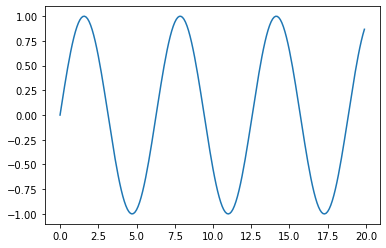
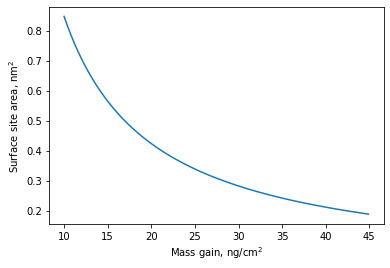
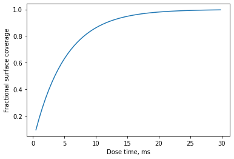
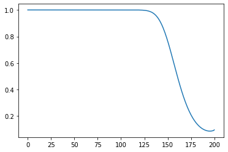
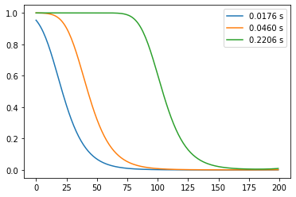
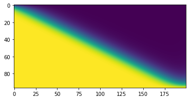
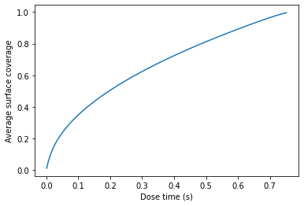

Machball: a very simple tutorial
================================

This is a simple tutorial on how to use and how to make the most of
Machball. It assumes that you have a Python distribution with the
jupyter environment, numpy (which is one of Machball’s dependencies),
matplotlib, and Machball installed.

Let’s start by importing matplotlib and numpy:

.. code-block:: python

    import matplotlib.pyplot as pt
    import numpy as np

These packages will allow us to work with arrays and matrices as well as
to plot the results:

.. code-block:: python

    x = np.arange(0,20,0.1)
    y = np.sin(x)
    pt.plot(x,y)

.. parsed-literal::

    [<matplotlib.lines.Line2D at 0x11769d250>]

Defining an ALD process in Machball
-----------------------------------

Machball defines an ideal ALD process using the ``ALDIdeal`` class. It
implements a first order irreversible Langmuir kinetics. Key parameters
are the precursor pressure (in Pa), molecular mass (in amu or
grams/mole), the bare or initial sticking probability (the reactivity of
a precursor molecule towards an available surface site), the temperature
of the process (in K) and the average area of a surface site (in square
meters).

Defining process parameters
~~~~~~~~~~~~~~~~~~~~~~~~~~~

We can start by defining some of these parameters:

.. code-block:: python

    p = 10
    M = 150
    beta = 1e-2
    T = 473

The average area of a surface site is perhaps the less intuitive of the
parameters. However, Machball provides two functions that can be used to
calculate this value from the growth per cycle or the mass per cycle.

.. code-block:: python

    from machball.utils import sitearea, sitearea_fromqcm

If we look at the documentation of these two functions:

.. code-block:: python

    help(sitearea)

.. parsed-literal::

    Help on function sitearea in module machball.utils:

    sitearea(M, density, gpc, nmol=1)
        Average area of a surface site

        Calculate the average area of a surface site

        Parameters
        ----------

        M : float
            Molecular mass in atomic mass units
        density : float
            Density of the film, in g/cm3
        gpc : float
            Growth per cycle, in Angstroms
        nmol : int, optional (default 1)
            Number of precursor molecules per unit formula of the solid

        Returns
        -------
        float
            Average area of a surface site in sq. meters

.. code-block:: python

    help(sitearea_fromqcm)

.. parsed-literal::

    Help on function sitearea_fromqcm in module machball.utils:

    sitearea_fromqcm(M, mpc, nmol=1)
        Average area of a surface site

        Calculate the average area of a surface site from qcm data

        Parameters
        ----------

        M : float
            Molecular mass in atomic mass units
        mpc : float
            Mass per cycle in  ng/cm2
        nmol : int, optional (default 1)
            Number of precursor molecules per unit formula of the solid

        Returns
        -------
        float
            Average area of a surface site in sq. meters

They help establish a connection between experimental observables and
the average area of a surface site. Let’s use 35 ng/cm2 as the mass gain
per cycle and the molar mass of Al2O3:

.. code-block:: python

    sitearea_fromqcm(102, 35, 2)

.. parsed-literal::

    2.4196991981781087e-19

Let’s plot the value of the site area for alumina for a range of mass
gain per cycle:

.. code-block:: python

    mgain = np.arange(10,45,0.1)
    areas = 1e18*sitearea_fromqcm(102, mgain, 2) # Convert to square Angstrom
    pt.plot(mgain, areas)
    pt.xlabel(r"Mass gain, ng/cm$^2$")
    pt.ylabel(r"Surface site area, nm$^2$")

.. parsed-literal::

    Text(0, 0.5, 'Surface site area, nm$^2$')

So let’s define a value of s0:

.. code-block:: python

    s0 = 20e-20

Working widh ALDIdeal
~~~~~~~~~~~~~~~~~~~~~

Let’s import ``ALDIdeal`` and define our ALD chemistry:

.. code-block:: python

    from machball import ALDIdeal

    ald = ALDIdeal(beta, M, T, p, s0, betarec=0)

The first thing we can do is to use the ``dose`` method to calculate the
effect of a dose:

.. code-block:: python

    ald.dose(0.02) # dose time in seconds

.. parsed-literal::

    0.9809029825287979

The returned value is the fractional coverage after the dose. It is
important to remember that, at this point, doses are not accumulative
yet. If you repeat the same dose, you will obtain the same value:

.. code-block:: python

    ald.dose(0.02)

.. parsed-literal::

    0.9809029825287979

This is something that will be changed in the next version, to be able
to monitor the effect of multiple microdoses

``ALDIdeal`` also has a method for directly calculating the saturation
curve:

.. code-block:: python

    times, cov = ald.saturation()

This method returns a list of times and saturation coverages. Let’s plot
them:

.. code-block:: python

    pt.plot(1e3*times,cov)
    pt.xlabel("Dose time, ms")
    pt.ylabel("Fractional surface coverage")

.. parsed-literal::

    Text(0, 0.5, 'Fractional surface coverage')

We can save the saturation profile to a file using ``save_saturation``

.. code-block:: python

    from machball.utils import save_saturation
    save_saturation("mysaturation.dat", times, cov)

The default is to save it as a space-delimited file. If instead, you
want to save it as a comma separated value, we need to specify the
``csv`` flag:

.. code-block:: python

    save_saturation("mysaturation.csv", times, cov, csv=True)

In both cases the output can be imported pretty much anywhere.
``mysaturation.csv`` can be directly read by any spreadsheet software,
should you use such unholy creatures.

Simulating ballistic transport inside nanostructures
----------------------------------------------------

The first step is to define a nanostructure. For this tutorial, we are
going to focus on circular vias, which are pre-defined in Machball.
However, Machball allows for the simulation of ballistic transport in
arbitrary geometries as long as the view factors are provided.

We first need to import and create our nanostructure:

.. code-block:: python

    from machball.ballistic import Via

``Via`` discretizes a circular via in a number of equally sized segments
plus the bottom. In order to instantiate a specific via, we need to pass
the aspect ratio, defined as the depth/diameter ratio, and the number of
vertical segments:

.. code-block:: python

    st = Via(100, 200)

We can now use the same interface as we used for exploring the evolution
of surface coverage on a flat surface. First, we can look at the result
of a specific dose:

.. code-block:: python

    cov = ald.dose(0.5, st)

The difference with the flat case is that we are passing the
nanostructura as an argument to the ``dose`` method of our ``ALDIdeal``
object that we created before.

If we directly plot the output we see the coverage for all the different
elements:

.. code-block:: python

    pt.plot(cov)

.. parsed-literal::

    [<matplotlib.lines.Line2D at 0x117c53850>]

It is important to note, though, that in the output of ``dose`` also
contains the coverage in the bottom of the feature. In fact, if we look
at the length of ``cov``:

.. code-block:: python

    len(cov)

.. parsed-literal::

    201

It has 201 elements whereas in the definition of our via we specified
200 vertical segments. The coverage at the bottom is stored in the last
element of the array. Therefore, if we want to plot as a function of
depth, we need to leave that element out:

.. code-block:: python

    cov_wall = cov[:-1] # This creates a slice of the array which leaves the last element out

.. code-block:: python

    len(cov_wall)

.. parsed-literal::

    200

.. code-block:: python

    pt.plot(cov_wall)

.. parsed-literal::

    [<matplotlib.lines.Line2D at 0x117d29b90>]

Like in the flat case, we can also directly calculate the saturation
profile. This will give us a sequence of coverage profiles as a function
of time:

.. code-block:: python

    times2, covs2 = ald.saturation(st, endcov=0.95, verbose=False)

``covs2`` is a 2D array. If we look at its shape:

.. code-block:: python

    covs2.shape

.. parsed-literal::

    (97, 201)

We see that each row represents a coverage profile for a given time.

Using slices we can plot specific times:

.. code-block:: python

    pt.plot(covs2[10,:-1], label=("%6.4f s" % times2[10]))
    pt.plot(covs2[20,:-1], label=("%6.4f s" % times2[20]))
    pt.plot(covs2[50,:-1], label=("%6.4f s" % times2[50]))
    pt.legend()

Note that, as before, we have used ``:-1`` to keep just the sidewall
regions of our via. We can also view the 2D array as an image:

.. code-block:: python

    pt.imshow(covs2[:,:-1])

.. parsed-literal::

    <matplotlib.image.AxesImage at 0x114cd5790>

However, it is important to note that the times are not linearly spaced,
since Machball uses an adaptive timestep to evolve the fractional
coverage with time:

.. code-block:: python

    times2

.. parsed-literal::

    array([0.00116806, 0.0023257 , 0.00375969, 0.00518084, 0.00659071,
           0.00826952, 0.00993597, 0.01159172, 0.01351175, 0.01542096,
           0.01759161, 0.01975197, 0.02217196, 0.02458257, 0.02725171,
           0.02991249, 0.03283113, 0.0360067 , 0.03917478, 0.04259959,
           0.04601785, 0.04969265, 0.05362351, 0.05754852, 0.06172949,
           0.06590523, 0.07033684, 0.07502397, 0.07970633, 0.08464415,
           0.08957763, 0.09476648, 0.09995134, 0.10539149, 0.11108671,
           0.1167782 , 0.1227247 , 0.12866773, 0.1348657 , 0.14131846,
           0.14776794, 0.15447215, 0.16117329, 0.16812911, 0.17508203,
           0.18228958, 0.18975165, 0.19721095, 0.20492472, 0.21263587,
           0.22060146, 0.22882137, 0.23703878, 0.24551048, 0.25397979,
           0.26270337, 0.27142466, 0.28040019, 0.28962988, 0.29885736,
           0.30833898, 0.31781848, 0.32755208, 0.33728365, 0.3472693 ,
           0.35750897, 0.36774667, 0.37823836, 0.38872815, 0.39947192,
           0.41046959, 0.42146543, 0.43271516, 0.44396312, 0.45546495,
           0.46696506, 0.47871902, 0.49072678, 0.50273287, 0.51499273,
           0.52725095, 0.53976293, 0.5522733 , 0.56503739, 0.57805512,
           0.59107124, 0.60434093, 0.6178641 , 0.63138553, 0.64516024,
           0.65918803, 0.67346856, 0.68800135, 0.70304037, 0.71858358,
           0.73538971, 0.75166171])

We can also plot the average surface coverage as a function of time

.. code-block:: python

    pt.plot(times2, np.mean(covs2,axis=1))
    pt.xlabel("Dose time (s)")
    pt.ylabel("Average surface coverage")

.. parsed-literal::

    Text(0, 0.5, 'Average surface coverage')

The resulting profiles has the parabolic shape that is expected from a
transport-limited process.

Finally, we can export the coverage profiles and the times to a file:

.. code-block:: python

    from machball.utils import save_saturationprofile

.. code-block:: python

    save_saturationprofile("via100.dat", times2, covs2)

Next steps
----------

This tutorial just went over some of the more basic features of
Machball. There are other capabilities we didn’t go through that are
fully documented, though not easily accessible. These include the
ability to work with other types of eatures, to compare with constant
reaction probability processes, and to expand the range of processes to
incoporate surface recombination and soft-saturating reactions.
